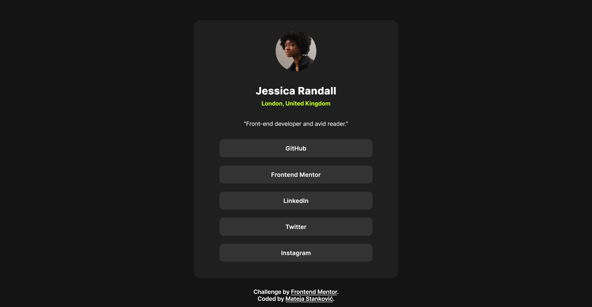

# Frontend Mentor - Social links profile solution

This is a solution to the [Social links profile challenge on Frontend Mentor](https://www.frontendmentor.io/challenges/social-links-profile-UG32l9m6dQ). Frontend Mentor challenges help you improve your coding skills by building realistic projects.

## Table of contents

- [Overview](#overview)
  - [The challenge](#the-challenge)
  - [Screenshot](#screenshot)
  - [Links](#links)
- [My process](#my-process)
  - [Built with](#built-with)
  - [Useful resources](#useful-resources)
- [Author](#author)

## Overview

### The challenge

Users should be able to:

- See hover and focus states for all interactive elements on the page

### Screenshot

### Links

- Solution URL: [https://www.frontendmentor.io/solutions/social-links-page-with-flexbox-28lVgQC2yY](https://www.frontendmentor.io/solutions/social-links-page-with-flexbox-28lVgQC2yY)
- Live Site URL: [https://matejadb.github.io/social-links-page/](https://matejadb.github.io/social-links-page/)

## My process

### Built with

- Semantic HTML5 markup
- CSS custom properties
- Flexbox

### Useful resources

- [W3Schools](https://www.example.com)

## Author

- Frontend Mentor - [@matejadb](https://www.frontendmentor.io/profile/matejadb)
- Twitter - [@matejadb](https://twitter.com/matejadb)
